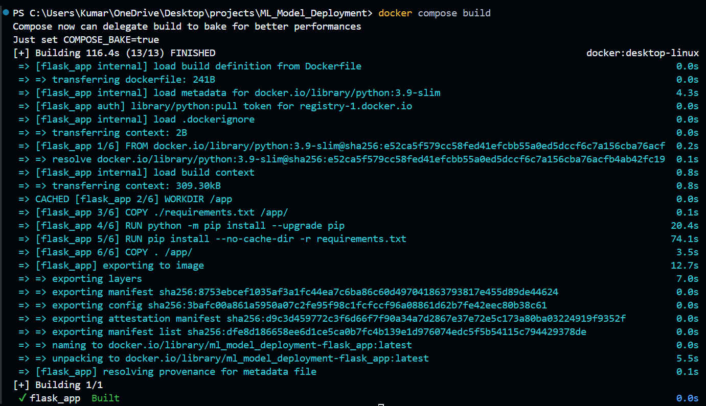

# Machine Learning Model Deployment Platform

- **Objective**: Build a platform to train and deploy machine learning models at scale.
- **Stack**:
    - **Docker Swarm**: To deploy containers and model APIs.
    - **Scikit-learn / TensorFlow**: For model training.
    - **Flask or FastAPI**: To serve the trained models as APIs.
    - **Prometheus + Grafana**: For monitoring resource utilization and model performance.

**1. Set Up the Project**

1. **Create a Project Directory**:
Run this in PowerShell:
    
    `mkdir ML_Model_Deployment && cd ML_Model_Deployment`
    
2. **Create a Virtual Environment**:
Run in PowerShell (root directory):
    
    `python -m venv venv
    .\venv\Scripts\activate`
    
3. **Install Dependencies**:
Run in the virtual environment:
    
    ```python
    pip install flask fastapi uvicorn prometheus-client docker-compose
    pip uninstall pywin32 
    pip freeze > requirements.txt
    ```
    

### **2. Build a Flask API for Model Training**

1. **Create a** `flask_app` **directory** and open VS Code:
    
    ```python
    mkdir flask_app && cd flask_app
    code .
    ```
    
2. **Create** `app.py`:
    
    ```python
    from flask import Flask, request, jsonify
    
    app = Flask(__name__)
    
    @app.route('/predict', methods=['POST'])
    def predict():
        data = request.json
        prediction = sum(data['input'])  # Mock prediction
        return jsonify({'prediction': prediction})
    
    if __name__ == '__main__':
        app.run(host='0.0.0.0', port=5000)
    ```
    
3. **Add a Dockerfile** in `flask_app`:

`COPY . /app/`: This ensures all files in the `flask_app` directory, including `app.py`, are copied into `/app` in the container.

```python
FROM python:3.9-slim
WORKDIR /app
COPY ./requirements.txt /app/   
RUN python -m pip install --upgrade pip
RUN pip install --no-cache-dir -r requirements.txt
COPY . /app/
CMD ["python", "app.py"]
```

### **3. Set Up Docker Compose**

1. **Go back to root directory** and create `docker-compose.yml`:

`context: ./flask_app`: This ensures the build context is set to the `flask_app` directory, where the `app.py` and `Dockerfile` are located

```powershell

services:
  flask_app:
    build:
      context: .
      dockerfile: flask_app/Dockerfile
    ports:
      - "5000:5000"
  prometheus:
    image: prom/prometheus
    ports:
      - "9090:9090"
    volumes:
      - ./prometheus.yml:/etc/prometheus/prometheus.yml
  grafana:
    image: grafana/grafana
    ports:
      - "3000:3000"
```

- `context: .` ensures that the root directory (including `requirements.txt`) is included in the build context.
- The `dockerfile: flask_app/Dockerfile` path specifies the Dockerfile's location inside the `flask_app` directory.
- 
1. **Create Prometheus Config** (`prometheus.yml` in root):
    
    
    ```powershell
    global:
      scrape_interval: 15s
    scrape_configs:
      - job_name: "flask_app"
        static_configs:
          - targets: ["flask_app:5000"]
    ```
    

### **4. Run the System with Docker Swarm**

1. **Initialize Docker Swarm** (root directory):
    
    `docker swarm init`
    
2. **Deploy the Stack**:

`docker compose build`

`docker-compose up -d`

1. **Access Services**:
    - Flask App: http://localhost:5000
    - Prometheus: http://localhost:9090
    - Grafana: http://localhost:3000




`docker run -d --name grafana -p 3000:3000 grafana/grafana`


**Node Exporter (deployed within the stack):** Open a web browser and go to `http://localhost:9101/metrics`. This will display metrics that Prometheus will scrape


**Verify Prometheus Targets:**

- In the Prometheus web UI (`http://localhost:9090`), go to "Status" > "Targets".
- Ensure that:
    - `node-exporter` (on `host.docker.internal:9101`) is "UP".
    - `model-api` (on `tasks.model-api:5000`) is "UP".


then we get :


`docker service update --image ml-model-api:latest ml-model-deployment_model-api`

